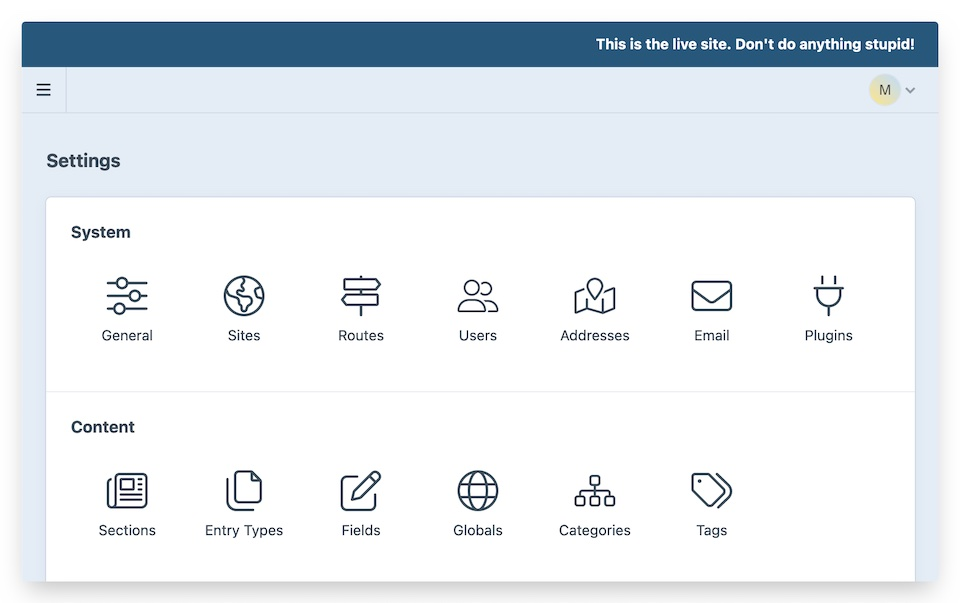
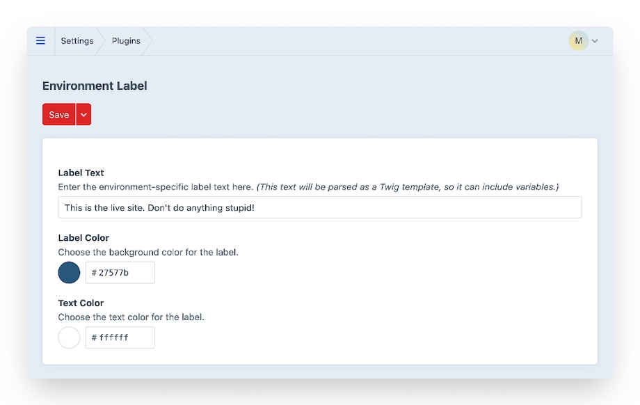

# Environment Label

_...so you don't forget where you are._

**A [Top Shelf Craft](https://topshelfcraft.com) creation**  
in collaboration with [Kind](https://madebykind.com/)


### TL;DR.

The _Environment Label_ plugin adds a nice coloured banner to your CraftCMS control panel so you'll never forget what environment you're using.

The colors and text of the environment label are configurable via the plugin config file.



* * *


## Installation

Visit the _Plugin Store_ in your Craft control panel, search for **Environment Label**, and click to **Install** the plugin.

You can also install the package via Composer.
```
composer require topshelfcraft/environment-label
```

Then, navigate to the _Plugins_ section of the control panel, find **Environment Label** in the list, and click the **Install** button.


## Configuration

By default, the environment label will display the value of Craft's `CRAFT_ENVIRONMENT` constant, which is usually set to the current hostname unless you override it.

_(In other words, out of the box, you get a red banner with white text that alerts you to the current hostname.)_

You can use a plugin config file to tweak the appearance and text of the environment label for each installation.

Simply add an `environment-label.php` file to your `config` directory.

```php
<?php

return [
    'showLabel' => true,
    'labelText' => CRAFT_ENVIRONMENT,
    'prefixText' => null,
    'suffixText' => null,
    'labelColor' => '#cc5643',
    'textColor' => '#ffffff',
    'targetSelector' => '#global-header:before',
];
```

For added flexibility, the full text of the label will be rendered as a Twig template, so you can also include template variables if you want:

```php
<?php

return [
    'suffixText' => " // {{ currentUser }}",
);
```


## Settings in the Control Panel

You can also make basic changes to the text and appearance of the environment label via the plugin Settings page.



</div>

This is provided as a convenience for easily testing out the plugin, but for full customizability, you should use a plugin config file as described above.

(Settings specified in the plugin config file will override any changes made via the Settings page in the control panel.)


## Twig template globals

_Environment Label_ makes its properties available via a Twig template global variable, so you can create your own
environment label rendering in your public templates:

```twig
{{ environmentLabel.renderedText }}
{{ environmentLabel.labelColor }}
{{ environmentLabel.textColor }}
```

## JavaScript globals

_Environment Label_ also makes its properties available as JS globals on each authenticated CP page.

```js
window.CRAFT_ENVIRONMENT
window.CRAFT_ENVIRONMENT_LABEL
```

## What are the system requirements?

Craft 4.0+ and PHP 8.0.2+


## I've found a bug.

No you haven't.


## Yes, I believe I have.

Well, alright. Please open a [GitHub Issue](https://github.com/topshelfcraft/Environment-Label/issues), and if you're feeling ambitious, submit a PR to the `4.x.dev` branch.


* * *

### Contributors:

  - Plugin development: [Michael Rog](https://michaelrog.com) / @michaelrog
  - Craft 2 plugin development: [Tom Davies](https://github.com/tomdavies) / @metadaptive
  - Icon: [NAS](http://nasztu.com/), via [The Noun Project](https://thenounproject.com/search/?q=label&i=28588)
